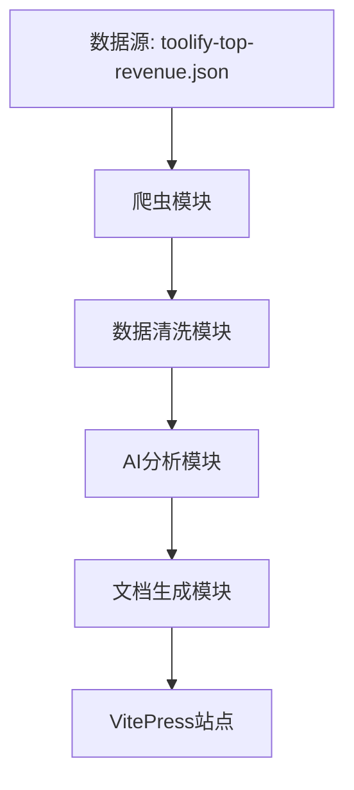

# AI Tools Insight - 技术方案文档

## 1. 系统架构

### 1.1 整体架构



### 1.2 模块说明

- 爬虫模块：负责获取工具详情页面内容
- 数据清洗模块：使用 jsdom 和 readability 提取有效内容
- AI 分析模块：调用大模型 API 进行分析
- 文档生成模块：生成 markdown 文档
- VitePress 站点：展示最终的分析结果

## 2. 技术选型

### 2.1 核心技术栈

- 运行时：Bun
- 文档框架：VitePress
- 网页解析：jsdom + @mozilla/readability
- AI SDK：AI SDK by Vercel
- 数据存储：文件系统（JSON + Markdown）

### 2.2 依赖说明

```json
{
  "dependencies": {
    "vitepress": "latest",
    "jsdom": "latest",
    "@mozilla/readability": "latest",
    "ai": "latest"
  }
}
```

## 3. 实现细节

### 3.1 数据采集流程

1. 读取 toolify-top-revenue.json
2. 检查 progressed.txt 避免重复请求
3. 使用 fetch 获取目标页面
4. 使用 jsdom 构建 DOM
5. 使用 readability 提取主要内容

```typescript
interface Tool {
  detail_url: string
  website: string
  // 其他字段...
}

async function fetchToolContent(tool: Tool): Promise<string> {
  const response = await fetch(tool.detail_url)
  const html = await response.text()
  const dom = new JSDOM(html)
  const reader = new Readability(dom.window.document)
  const article = reader.parse()
  return article.textContent
}
```

### 3.2 AI 分析流程

1. 读取 prompt.md 模板
2. 结合清洗后的内容构建提示词
3. 调用 AI SDK 获取分析结果

```typescript
async function analyzeContent(content: string, prompt: string): Promise<string> {
  const ai = new AISDK()
  const analysis = await ai.analyze(prompt, content)
  return analysis
}
```

### 3.3 文档生成流程

1. 解析工具 URL 获取文档名
2. 生成 markdown 文件
3. 更新 VitePress 配置

```typescript
function generateDoc(tool: Tool, analysis: string): void {
  const docName = extractToolName(tool.detail_url)
  const docPath = `docs/${docName}.md`
  writeFileSync(docPath, analysis)
}
```

### 3.4 进度追踪

1. 读取已处理列表
2. 更新进度文件
3. 错误重试机制

```typescript
async function updateProgress(tool: Tool): Promise<void> {
  const processed = await readProcessed()
  processed.push(tool.website)
  await writeProcessed(processed)
}
```

## 4. 部署方案

### 4.1 开发环境

- 本地运行爬虫和分析脚本
- 本地预览 VitePress 站点

### 4.2 生产环境

- 静态站点部署（GitHub Pages/Vercel）
- 定时更新机制（可选）

## 5. 安全考虑

- 控制爬虫请求频率
- AI API 密钥管理
- 错误处理和日志记录

## 6. 性能优化

- 并发请求控制
- 缓存机制
- 增量更新
